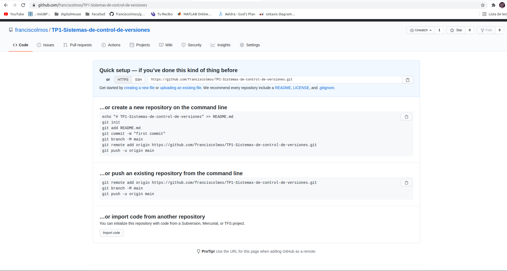

# ing-lab-4

## Trabajo Practico Nro 1

### __2- Crear un repositorio local y agregar archivos__

* Crear un repositorio local en un nuevo directorio.

    

* Agregar un archivo Readme.md, que contenga tu nombre y un link a tu CV. Tu cv será otro archivo en el mismo formato, en la misma carpeta.
    * [Readme.md](https://github.com/franciscolmos/TP1-Sistemas-de-control-de-versiones#francisco-augusto-olmos-bossa)
    * [Mi Curriculum Vitae](https://github.com/franciscolmos/TP1-Sistemas-de-control-de-versiones/blob/master/CV.md#francisco-augusto-olmos-bossa)
* Crear los commits de cada caso y proveer mensajes descriptivos.

    

### __3- Crear un repositorio remoto__

* Crear un nuevo repositorio en dicha página (vacío)

    * [Repositorio del TP1](https://github.com/franciscolmos/TP1-Sistemas-de-control-de-versiones)

    
* Asociar el repositorio local creado en el punto 2 al creado en github.
* Subir los cambios locales a github.

    

### __4- Familiarizarse con el concepto de Pull Request__

* Crear un branch local y agregar cambios a dicho branch
    * [Pull Request](https://github.com/franciscolmos/TP1-Sistemas-de-control-de-versiones/blob/master/PR.md)

     

* Subir el cambio a dicho branch y crear un pull request.
    

    

    

    

* Completar el proceso de revisión en github y mergear el PR al branch master.

     

### __5- Mergear código con conflictos__

*   Clonar en un segundo directorio de tu equipo el repositorio creado en github.
*   En el clon inicial, modificar el CV.md cambiando algunas lineas.
*   Hacer commit y subir el cambio a master a github.
*   En el segundo clon también realizar cambios en las mismas líneas que se modificaron en el otro directorio.
*   Intentar subir el cambio, haciendo un commit y push. Mostrar el error que se obtiene.

    

    

*   Resolver los conflictos del código.
*   Explicar las versiones LOCAL, BASE y REMOTE.
    * [LOCAL, BASE, REMOTO](https://github.com/franciscolmos/TP1-Sistemas-de-control-de-versiones#local-base-remoto)      
*   Pushear el cambio mergeado.

     

### __6- Algunos ejercicios online__

*   Entrar a la página https://learngitbranching.js.org/
*   Completar los ejercicios Introduction Sequence

    

